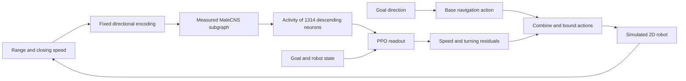

# ConnectomePilot

**English** | [简体中文](README.zh-CN.md)

**Explore robot residual control and reinforcement learning with a real fly connectome.**

ConnectomePilot connects the MaleCNS anatomical connectivity graph to a simulated mobile robot. Sensor inputs drive neural activity, and a policy readout produces corrections to a base navigation controller. The project includes an interactive Chinese-language demo, whole-brain and subgraph models, PPO baselines, learnable connection weights, staged training, and video export.

The best-performing training approach so far is to **jointly train internal connections and readout for 65,536 steps, then freeze the connections and continue training the readout to 4,194,304 total steps.**

## Demos

Two obstacle-avoidance rollouts with the same 4M-step policy (training seed 72), after joint training followed by frozen-connectome readout training. Each map was selected in advance and run once. These are individual demonstrations; aggregate evaluation is reported below.

### Map 5900000 · goal reached in 9.4 s

https://github.com/user-attachments/assets/b97df5b9-8961-4436-bbdb-86c1c4d8a3e9

10.14 m traveled · 9.9 cm minimum body clearance · [Download MP4](https://github.com/pgq18/ConnectomePilot/releases/download/v0.1.0/navigation-map-5900000.mp4)

### Map 5900001 · goal reached in 11.2 s

https://github.com/user-attachments/assets/ffebcfc2-c512-4cb2-a59d-9f2ae0e45254

11.07 m traveled · 10.2 cm minimum body clearance · [Download MP4](https://github.com/pgq18/ConnectomePilot/releases/download/v0.1.0/navigation-map-5900001.mp4)

Times above are simulated travel times; the videos include opening and closing still frames. The recordings show robot motion, obstacle sensing, control residuals, and modeled descending-neuron activity. [How to reproduce the videos](docs/VIDEOS.md).

## Current results

Evaluated on the same 500 held-out test maps with three training seeds:

| Measurement | Success rate |
|---|---:|
| Mean across three seeds at 1,048,576 steps | 85.1% |
| Mean across three seeds at 4,194,304 steps | 88.6% |
| Mean test result after selecting a checkpoint per seed using validation maps | 89.6% |
| Single model selected across seeds using the predefined validation rule | 89.4% |
| Highest test point observed retrospectively, seed 72 | 92.6% (463/500) |

The 92.6% result describes the highest observed test point; the single model selected by the predefined rule achieved 89.4%. Longer training did not improve performance monotonically, and average changes in angular velocity commands increased. See the [experiment report](docs/STAGED_4M_TRIAL.md) and [predefined protocol](docs/STAGED_4M_PROTOCOL.md).

The demos above use the seed-72 model with the highest retrospectively observed test score.

## Four ways to use the project

| Goal | Entry point | What it provides |
|---|---|---|
| Try interactive obstacle avoidance | `./launch.sh --open` | Base controller, rule-based baseline, whole-brain LIF model, and early SB3 PPO policies |
| Learn internal connection strengths | `scripts/train_plasticity.py` | Readout-only PPO, joint connection/readout PPO, and local three-factor learning |
| Reproduce staged training | [Training guide](docs/TRAINING.md) | 65k joint → 262k frozen → 1M → 4M; the final stage supports three parallel training processes |
| Run a policy and export video | [Video guide](docs/VIDEOS.md) | Record an actual policy rollout, render frames, then encode and validate the video |

The web interface uses the earlier controllers. The latest 4M subgraph policy runs through offline evaluation and video tools and is not yet available in the web menu.

## Quick start

Install Conda first. All Python packages belong in the project-specific environment. Conda manages the environment location; it does not need to live inside the repository. Run:

```bash
git clone https://github.com/pgq18/ConnectomePilot.git
cd ConnectomePilot
conda env create -f environment.yml
conda activate fruit-fly-lab
./launch.sh --open
```

Open <http://127.0.0.1:8765>. The base controller and rule-based obstacle avoidance work without downloading connectome data. Fly-brain mode remains disabled until the data is available. Run the launch command from a terminal with `fruit-fly-lab` activated.

### Set goals interactively

Click an empty spot on the map to place a goal. The displayed coordinates use meters. You can change the goal while the robot is moving; when paused, select a goal and press **Continue / Start**.

Each goal change starts a new leg from the robot's current position and resets its trajectory, timer, and metrics. Goals must leave enough room for the robot around obstacles and walls. After a collision, reset the scene first. Resetting the same map or switching controllers preserves your chosen goal; changing the map restores the default goal. Use **Restore default goal** to switch back explicitly.

The published benchmark scores use the original fixed-goal tasks. Performance on arbitrary interactive goals has not been benchmarked.

### Prepare the measured connectome

```bash
python scripts/prepare_data.py --check-network
python scripts/prepare_data.py
```

The script downloads approximately 1.2 GB of raw tables from the official MaleCNS storage and produces sparse weights, annotations, and provenance hashes. Preprocessing requires additional RAM and disk space. The full graph loaded by this project contains **166,700 neurons and 25,582,938 directed connections**.

Downloads support validation, retries, and resumption. If a proxy is needed, copy `config/network.example.json` to `config/network.local.json` and edit it, or pass `--proxy http://127.0.0.1:PORT`. Use `--no-proxy` for a direct connection.

### Install training dependencies

```bash
python -m pip install -r requirements/train.txt
```

The web demo and small sensor-based PPO runs can use a CPU. The current staged trainers require NVIDIA CUDA. See the [training guide](docs/TRAINING.md) and [workstation guide](docs/WORKSTATION.md) for GPU setup, measured resource use, and reproduction commands.

Conda setup installs the base simulation and data dependencies automatically. Add `requirements/train.txt` for training or `requirements/viz.txt` for plots and video rendering, using the same environment. [Dependency profiles and historical snapshots](requirements/README.md) are kept under `requirements/`; the snapshots are references for older experiments, not additional installation steps.

## How it works



The latest policy uses **4,096 neurons and 459,342 permitted connections**. It retains measured connection locations and learns their strengths during joint training. After freezing, neural propagation still runs at every control step; PPO updates only the **3,960 actor/critic readout parameters**.

Connection locations come from anatomical data. Transmitter signs, normalized weights, sensory encoding, simplified neural dynamics, and action mappings involve engineering assumptions. The model does not contain a biological fly's learned memories or reproduce a complete biological brain. Validation currently covers a 2D simulation; robot dynamics simulators and hardware integration remain future work.

## Code and documentation

```text
flylab/        Simulation, controllers, neural models, learning, and state recovery
scripts/       Data preparation, training, evaluation, audits, plots, and video tools
tests/         Environment, propagation, gradients, freezing, resumption, and selection
web/           Chinese-language interactive interface
config/        Public network configuration example
docs/          Architecture, usage guides, experiment protocols, and reports
requirements/  Base, training, visualization profiles, and historical snapshots
data/          Local downloaded and processed data (excluded from Git)
results/       Local models, logs, plots, and videos (excluded from Git)
```

Detailed guides and experiment reports are currently in Chinese:

- [Architecture and module responsibilities](docs/ARCHITECTURE.md)
- [Training and evaluation reproduction](docs/TRAINING.md)
- [Video export](docs/VIDEOS.md)
- [Documentation and experiment index](docs/README.md)
- [Robot interfaces and extensions](docs/ROBOTICS.md)

See also the English [contribution guide](CONTRIBUTING.md).

Raw data and model checkpoints are not distributed with the Git source. Prepare the data from the official source, then follow the training guide. Historical reports preserve measured results; the referenced `results/` artifacts reside in the experiment workspace.

## Validation

After installing the training dependencies:

```bash
python -m unittest discover -s tests -v
```

Tests use explicitly labeled small synthetic graphs to verify interfaces, numerical calculations, and state recovery. These fixtures are not biological experiment results. GitHub Actions runs CPU tests in a dedicated Conda environment without downloading MaleCNS or training models.

## Sources and licensing

Code is released under the [MIT License](LICENSE). MaleCNS data has a separate [CC BY 4.0 license](https://male-cns.janelia.org/download/).

Data preparation and early simplified dynamics draw on [fly.ai](https://github.com/alextitonis/fly.ai). PPO with fixed connection locations and reward-modulated learning rules are inspired by [FlyDoom](https://github.com/eganeganegan/flydoom). See [third-party notices](docs/THIRD_PARTY.md) for other references and adaptation details.
