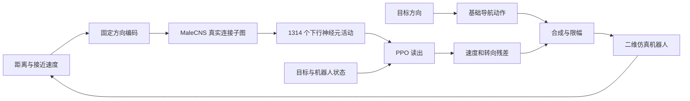

# ConnectomePilot · 蝇脑领航

[English](README.md) | **简体中文**

**用真实果蝇连接组探索机器人残差控制与强化学习。**

ConnectomePilot is a connectome-informed reinforcement learning lab for simulated robot navigation.

项目把 MaleCNS 解剖连接图接入二维移动机器人：传感器输入驱动神经活动，策略读出给基础导航动作增加修正。包含中文交互演示、整脑与子图模型、PPO 对照、连接权重学习、分阶段续训和视频导出。

当前效果最好的训练路线是：**前 65,536 步联合学习脑内连接和读出，随后冻结连接，继续训练读出至 4,194,304 步。**

## Demo 视频

两段避障录像使用同一个训练种子 72、4M 步策略，采用先联合训练、再冻结脑内连接续训读出的方式。每张地图预先选定，只运行一次。这是单回合演示，整体评估结果见下节。

### 地图 5900000 · 9.4 秒到达目标

https://github.com/user-attachments/assets/b97df5b9-8961-4436-bbdb-86c1c4d8a3e9

路径 10.14 m · 最小车体间隙 9.9 cm · [下载 MP4](https://github.com/pgq18/ConnectomePilot/releases/download/v0.1.0/navigation-map-5900000.mp4)

### 地图 5900001 · 11.2 秒到达目标

https://github.com/user-attachments/assets/ffebcfc2-c512-4cb2-a59d-9f2ae0e45254

路径 11.07 m · 最小车体间隙 10.2 cm · [下载 MP4](https://github.com/pgq18/ConnectomePilot/releases/download/v0.1.0/navigation-map-5900001.mp4)

上述用时为仿真行驶时间，视频首尾另有静帧。画面同时展示行驶轨迹、障碍感知、控制残差和模型中的下行神经元活动。[视频复现方法](docs/VIDEOS.md)。

## 当前结果

同一批 500 张独立测试地图，3 个训练种子：

|统计口径|成功率|
|---|---:|
|1,048,576 步起点，三个种子平均|85.1%|
|4,194,304 步终点，三个种子平均|88.6%|
|每个种子先按验证集选模，再取测试均值|89.6%|
|跨种子按预定验证规则选出的单模型|89.4%|
|测试曲线事后观察到的最高单点，种子 72|92.6%（463/500）|

92.6% 用于展示本轮观察到的最高结果；按预定规则选出的单模型成绩为 89.4%。训练变长并非持续变好，平均转向指令变化也有所增加。详见[实验报告](docs/STAGED_4M_TRIAL.md)与[预定协议](docs/STAGED_4M_PROTOCOL.md)。

上方视频使用测试曲线事后观察到最高单点的种子 72 模型。

## 四条使用路线

|想做什么|入口|说明|
|---|---|---|
|交互体验避障|`./launch.sh --open`|基础控制、规则对照、整脑 LIF、早期 SB3 PPO|
|学习内部连接|`scripts/train_plasticity.py`|读出 PPO、脑内连接＋读出 PPO、局部三因素学习|
|复现分阶段训练|[训练指南](docs/TRAINING.md)|65k 联合 → 262k 冻结 → 1M → 4M；末阶段支持三进程并行|
|回放模型并导出视频|[视频指南](docs/VIDEOS.md)|记录一次真实策略回合 → 渲染 → 编码并校验|

网页仍展示早期控制器；最新 4M 子图策略通过离线评估和视频入口运行，尚未接入网页菜单。

## 快速开始

需要已安装 Conda。所有 Python 包安装到独立环境，位置由 Conda 管理，无须放在项目目录下：

```bash
git clone https://github.com/pgq18/ConnectomePilot.git
cd ConnectomePilot
conda env create -f environment.yml
conda activate fruit-fly-lab
./launch.sh --open
```

打开 <http://127.0.0.1:8765>。不下载连接数据也可使用基础控制和规则避障；缺少数据时果蝇脑选项禁用。启动前在终端激活 `fruit-fly-lab` 环境。

### 鼠标交互设置目标

点击地图空白处即可设置目标，坐标以米显示。运行中可以直接改点；暂停时先设点，再点击“继续 / 开始”。

每次改点从小车当前位置开始新一段行程，重置轨迹、计时和统计。目标需为小车留出远离障碍物和墙边的空间；碰撞后须先重置场景。同一地图重置或切换控制器会保留所选目标，换地图则恢复默认目标，也可以点击“恢复默认目标”按钮。

已公布的成功率来自原始固定目标任务，任意交互目标的表现尚未做基准评估。

### 准备真实连接组

```bash
python scripts/prepare_data.py --check-network
python scripts/prepare_data.py
```

从 MaleCNS 官方存储下载约 1.2 GB 原始表，生成稀疏权重、注释和来源哈希。预处理需要额外内存和磁盘空间；本项目加载的全图含 **166,700 个神经元、25,582,938 条有向连接**。

下载支持校验、重试和断点续传。需要代理时，复制 `config/network.example.json` 为 `config/network.local.json` 并修改，或使用 `--proxy http://127.0.0.1:端口`；`--no-proxy` 强制直连。

### 安装训练依赖

```bash
python -m pip install -r requirements/train.txt
```

网页和小型传感器 PPO 可在 CPU 上运行；当前分阶段训练器要求 NVIDIA CUDA。GPU 安装方法、实测资源和复现命令见[训练指南](docs/TRAINING.md)及[工作站指南](docs/WORKSTATION.md)。

Conda 创建环境时自动安装基础仿真与数据依赖。训练时补装 `requirements/train.txt`，绘图与渲染视频时补装 `requirements/viz.txt`，都使用同一个环境。[依赖清单与历史快照](requirements/README.md)统一放在 `requirements/`；快照仅用于核对旧实验环境，无须额外逐份安装。

## 工作原理



最新策略使用 **4,096 个神经元、459,342 条允许连接**，保留测量得到的连接位置，在联合训练阶段学习连接强度。冻结后，神经传播仍逐步执行，PPO 只更新 **3,960 个 actor/critic 读出参数**。

连接位置来自解剖数据；递质符号、归一化权重、感觉编码、简化神经动态和动作映射包含工程建模。它不包含生物果蝇的记忆，也不代表完整生物脑复现。目前仅验证二维仿真，机器人动力学仿真和硬件接入尚待实现。

## 代码与文档

```text
flylab/        仿真世界、控制器、神经模型、学习和状态恢复
scripts/       数据准备、训练、评估、审计、图表和视频工具
tests/         环境、数值传播、学习梯度、冻结、续训与选模测试
web/           中文交互界面
config/        可公开的网络配置示例
docs/          架构、使用路线、实验协议和结果报告
requirements/  基础、训练、可视化依赖及历史环境快照
data/          本地下载与处理后的数据（不入 Git）
results/       本地模型、日志、图表和视频（不入 Git）
```

- [功能实现与模块对应](docs/ARCHITECTURE.md)
- [训练与评估复现](docs/TRAINING.md)
- [视频导出](docs/VIDEOS.md)
- [文档与实验索引](docs/README.md)
- [机器人接口与扩展](docs/ROBOTICS.md)
- [贡献指南](CONTRIBUTING.md)

原始数据和模型检查点不随 Git 源码分发；从官方源准备数据后按指南训练。历史报告保留实际测量值，提到的 `results/` 产物位于实验工作目录。

## 验证

安装训练依赖后：

```bash
python -m unittest discover -s tests -v
```

测试使用明确标注的人工小图验证接口、数值计算和状态恢复，不作为生物实验结果。GitHub Actions 在独立 Conda 环境执行 CPU 测试，无需下载 MaleCNS 或训练模型。

## 来源与许可

代码采用 [MIT License](LICENSE)。MaleCNS 数据许可独立于代码，遵循 [CC BY 4.0](https://male-cns.janelia.org/download/)。

数据处理与早期简化动力学参考 [fly.ai](https://github.com/alextitonis/fly.ai)；固定连接位置的 PPO 与奖励调制规则借鉴 [FlyDoom](https://github.com/eganeganegan/flydoom)。其他实验参考及适配说明见[第三方说明](docs/THIRD_PARTY.md)。
